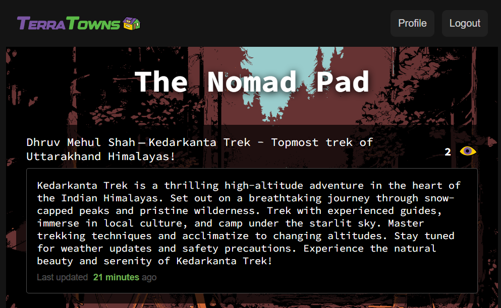
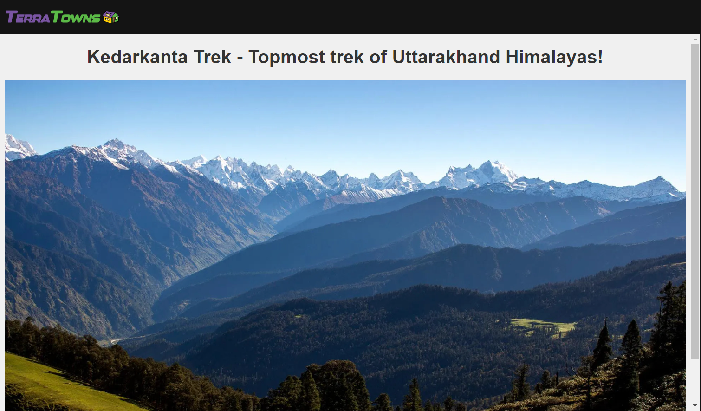
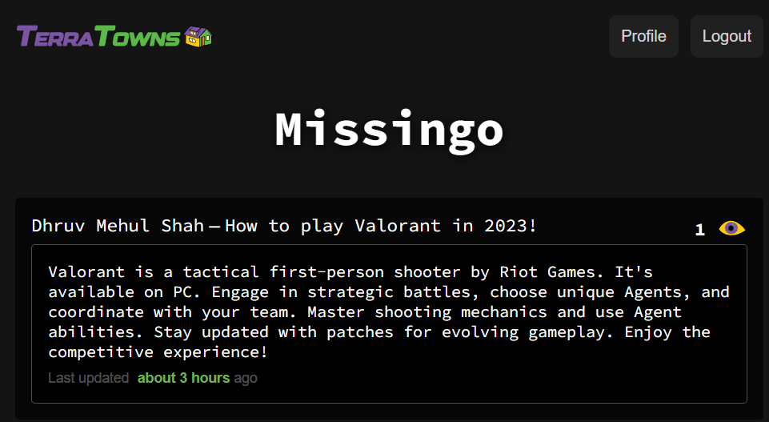
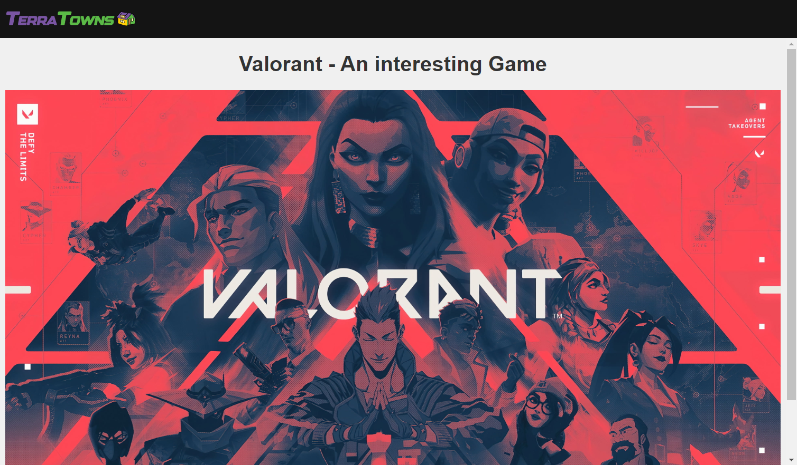

# Terraform Beginner Bootcamp 2023

## Project Description
TerraTowns is a community website that acts as a hub to discover and connect Terraformers(associates that signed up for the bootcamp) to each other's self-hosted personal websites in the style of Geocities of 2023.

Terraformers will write the infrastructure as Code (IaC) to launch their Terra House.

A Terra House is a simple Content Management System (CMS) that will allow you to author your own personal website and connect it to the TerraTowns network.

Terraformers need to choose a theme or topic of interest and build their page around existing community hubs. 

## Weekly Journals
- [Week 0 Journal](journal/week0.md)
- [Week 1 Journal](journal/week1.md)
- [Week 2 Journal](journal/week2.md)

## Extras
- [Github Markdown TOC Generator](https://ecotrust-canada.github.io/markdown-toc/)

## My Completed Homes
**My first Test house!**

**My second Test house!**

