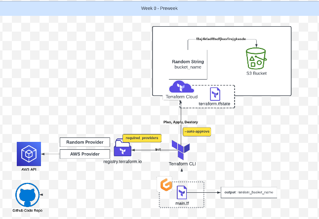
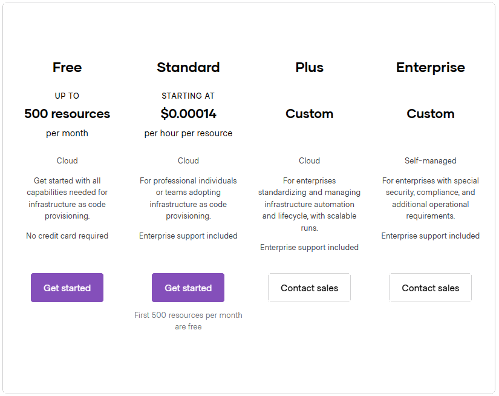
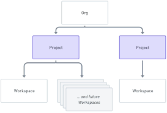

# Terraform Beginner Bootcamp 2023 - Week  0

[Week-0 Architecture](#week-0-architecture)

[Notes for quick reference](#notes-for-quick-reference)
- [Semantic Versioning :mage:](#semantic-versioning--mage-)
- [Install Terraform CLI](#install-terraform-cli)
  * [Considerations for Terraform CLI changes](#considerations-for-terraform-cli-changes)
  * [Considerations for Linux Distribution](#considerations-for-linux-distribution)
  * [Refactoring into Bash Scripts](#refactoring-into-bash-scripts)
    + [Shebang Considerations](#shebang-considerations)
  * [Execution Consideration](#execution-consideration)
    + [Linux Permissions Considerations](#linux-permissions-considerations)
- [Gitpod Lifecycle](#gitpod-lifecycle)
- [Working with Env Vars](#working-with-env-vars)
  * [env command](#env-command)
  * [Setting and Unsetting Env Vars](#setting-and-unsetting-env-vars)
  * [Printing Env Vars](#printing-env-vars)
  * [Scoping of Env Vars](#scoping-of-env-vars)
  * [Persisting Env Vars in Gitpod](#persisting-env-vars-in-gitpod)
- [Install AWS CLI](#install-aws-cli)
- [Terraform Basics](#terraform-basics)
  * [Terraform Registry](#terraform-registry)
  * [Terraform Console](#terraform-console)
    + [Terraform Init](#terraform-init)
    + [Terraform Plan](#terraform-plan)
    + [Terraform Apply](#terraform-apply)
    + [Terraform Destroy](#terraform-destroy)
    + [Terraform Lock Files](#terraform-lock-files)
    + [Terraform State Files](#terraform-state-files)
    + [Terraform Directory](#terraform-directory)
    * [AWS Credentials](#aws-credentials)
    + [Terraform flow for reading credentials](#terraform-flow-for-reading-credentials)
  * [Error while implementing Random Provider](#error-while-implementing-random-provider)
  * [Terraform Cloud Basics](#terraform-cloud-basics)
    + [Terraform Workspace versus Terraform Project](#terraform-workspace-versus-terraform-project)
    + [Types of Terraform Workspace Workflows](#types-of-terraform-workspace-workflows)
    + [Terraform login and credentails.trfc.json file](#terraform-login-and-credentailstrfcjson-file)
  * [Issues with Terraform Cloud Login and Gitpod Workspace](#issues-with-terraform-cloud-login-and-gitpod-workspace)
  * [TF alias](#tf-alias)
- [AWS S3 Bucket](#aws-s3-bucket)

# Week 0 Architecture


The complete end-to-end architecture of what we will achieve at the end of the bootcamp is available [here](https://lucid.app/lucidchart/e3f15b1a-2211-4ddb-8c95-f144c2504db4/edit?invitationId=inv_0873b3c6-c652-463f-9f2b-fa0f1b420823&page=0_0#) 

_Diagram copyrights: Andrew Brown from ExamPro.co_

-----------------------------------------------------------------------------------------------------
# Notes For Quick Reference

## Semantic Versioning :mage: 
This project is going to utilize semantic versioning for it's tagging.
[semver.org](https://semver.org)
The general format:

 **MAJOR.MINOR.PATCH**, eg. `1.0.1`

- **MAJOR** version when you make incompatible API changes
- **MINOR** version when you add functionality in a backward compatible manner
- **PATCH** version when you make backward compatible bug fixes

## Install Terraform CLI

### Considerations for Terraform CLI changes
The Terraform CLI installation instructions have changed due to gpg keyring changes. So we needed refer to the latest install CLI instructions via Terraform Documentation and change the scripting for install.

[Install Terraform CLI](https://developer.hashicorp.com/terraform/tutorials/aws-get-started/install-cli)

### Considerations for Linux Distribution
This project is built againt Ubuntu. 
Please consider checking your Linux Distribution and change accordingly to distribution needs.

[How to check OS Version in Linux](https://www.cyberciti.biz/faq/how-to-check-os-version-in-linux-command-line/)

Example for checking the OS Version:

```
$ cat /etc/os-release
PRETTY_NAME="Ubuntu 22.04.3 LTS"
NAME="Ubuntu"
VERSION_ID="22.04"
VERSION="22.04.3 LTS (Jammy Jellyfish)"
VERSION_CODENAME=jammy
ID=ubuntu
ID_LIKE=debian
HOME_URL="https://www.ubuntu.com/"
SUPPORT_URL="https://help.ubuntu.com/"
BUG_REPORT_URL="https://bugs.launchpad.net/ubuntu/"
PRIVACY_POLICY_URL="https://www.ubuntu.com/legal/terms-and-policies/privacy-policy"
UBUNTU_CODENAME=jammy
```


### Refactoring into Bash Scripts
While fixing the Terraform CLI gpg deprecation issues we notice that bash scripts steps were considerably more. So we decide to create a bash script to install the Terraform CLI.

This bash script is located here: [./bin/install_terraform_cli](./bin/install_terraform_cli.sh)

- This will keep the Gitpod Task File([.gitpod.yml](.gitpod.yml))
- This allow us to easily debug and execute manually Terraform CLI install.
- This will allow better portability for other project that need to install Terraform CLI.

#### Shebang Considerations
A Shebang tells the bash script what program that will interpret the script. eg. `#!/bin/bash`

[Shebang](https://en.wikipedia.org/wiki/Shebang_(Unix))

ChatGPT recommended this format for Bash: `#!/usr/bin/env bash`

- For portability to different OS distributions.
- Will search the user's PATH for the bash executable.

### Execution Consideration

When executing the Bash script, we can use `./` shorthand notation to execute the Bash script.

eg. `./bin/install_terraform_cli.sh`

If we are using a script in .gitpod.yml we need to point the script to a program to the interpret it.

eg. `source ./bin/install_terraform_cli.sh`

#### Linux Permissions Considerations
In order to make the Bash scripts executable, we need to change the linux permissions for the fix to be executable at the user mode.

```
chmod u+x ./bin/install_terraform_cli.sh
```
Alternatively:
```
chmod 744 ./bin/install_terraform_cli.sh
```
[Linux Permissions](https://en.wikipedia.org/wiki/Chmod)

## Gitpod Lifecycle 
Gitpod Lifecycle - Before, Init, Command

We need to be careful when using the Init because it will not re-run if we restart the existing workspace.

[Github Lifecycle](https://www.gitpod.io/docs/configure/workspaces/tasks)

## Working with Env Vars

### env command
We can list out all Environment Variables (Env Vars) using the `env` command

We can filter specific env vars using grep. eg. `env | grep AWS_`

### Setting and Unsetting Env Vars
In the terminal we can set using `export HELLO='world'`.

In ther terminal we can unset using `unset HELLO`.

We can set an env var temporarily when just run a command.

```sh
HELLO='world' ./bin/print_message
```

Within a bash script, we can set an env without writing export. eg.

```sh
#!/usr/bin/env bash
HELLO= 'world'
echo $HELLO
```
### Printing Env Vars
We can print an env var using echo eg. `echo $HELLO`

### Scoping of Env Vars
When you open up new bash terminals in VScode it will not be aware of Env Vars that you have set in other window.

If you want Env Vars to persist across all the future bash terminals, you need to set Env Vars in the bash profiles. eg. `.bash_profile`

### Persisting Env Vars in Gitpod
We can persist Env Vars in Gitpod by storing them in Gitpod Secrets Storage.
```
gp env HELLO='world'
```
All future workspaces launched will set the env vars for all bash terminals opened in those workspaces.

You can also set env vars in the `.gitpod.yml` file but this can only contain non-sensitive env vars.

## Install AWS CLI

AWS CLI is installed for this project via the bash script [`./bin/install_aws_cli`](./bin/install_aws_cli.sh).

[Getting started with AWS CLI installation](https://docs.aws.amazon.com/cli/latest/userguide/getting-started-install.html)

[AWS CLI Env Vars](https://docs.aws.amazon.com/cli/latest/userguide/cli-configure-envvars.html)

We can check if our AWS credentials is configured by running the following AWS CLI command:
```sh
aws sts get-caller-identity
```
If it is successful you should see a json payload return that looks like this:
```json
{
    "UserId": "UBWA4JCHFG6V4OQT6457Y",
    "Account": "123456789012",
    "Arn": "arn:aws:iam::123456789012:user/terraform-beginner-bootcamp"
}
```
We will need to generate AWS CLI credentials from IAM User to use the AWS CLI.

## Terraform Basics

### Terraform Registry
Terraform sources their providers and modules from the Terraform registry which is located at [registry.terraform.io](https://registry.terraform.io/)

- **Providers** is an interface to APIs that will allow to create resources in Terraform.
- **Modules** are a way to make large amount of terraform code modular, portable and shareable. 

[Random Terraform Provider](https://registry.terraform.io/providers/hashicorp/random/latest)

### Terraform Console
We can see a list of all the Terraform commands by simply typing `terraform`

#### Terraform Init
`terraform init`

At the start of new terraform project we will run `terraform init` to download the binaries for the terraform providers that we'll use in this project.

#### Terraform Plan
`terraform plan`

This will generate out a changeset, about the state of our infrastructure and what will be changed.

We can output this changeset i.e., "plan" to be passed to an apply, but often you can just ignore outputting.

#### Terraform Apply
`terraform apply`

This will run a plan and pass the changeset to be executed by Terraform. Apply should prompt yes or no.

If we want to automatically approve an apply we can provide the auto approve flag. eg., `terraform apply --auto-approve`

#### Terraform Destroy
`terraform destroy`

This will destroy resources. 

You can also use the auto approve flag to skip the approve prompt. eg., `terraform destroy --auto-approve`

#### Terraform Lock Files

`.terraform.lock.hcl` contains the locked versioning for the providers or modules that should be used for this project.

The Terraform lock files **should be committed** to the Version Control System (VCS) eg., GitHub

#### Terraform State Files

`.terraform.tfstate` contain information about the current state of the infrastructure.

This file **should not be committed** to the VCS. This file can contain the sensitive data. If you lose this file, you will lose knowing the state of the infrastructure.

`.terraform.tfstate.backup` is the previous state file state. 

#### Terraform Directory

`.terraform` directory contains binaries of terraform providers.

### AWS Credentials
Terraform needs our AWS credentials in order to create the defined AWS resource (S3 bucket in this case).
These credentails can be defined in the `main.tf` file, but this is **not recommended**, since the main.tf will be commited to our code repository. The better way to safely use credentials is to set them as `env vars`.

#### Terraform flow for reading credentials
(1) check config file _if not present, then_ -> (2) read from env vars

### Error while implementing Random Provider
S3 buckets have specific naming conventions. During our implementation we ran into an error, since our random bucket name generator allowed `UPPERCASE alphabets`. To tackle this, we explicitely denied the presence of uppercase letters in the code.
```tf
provider "random" {
  # Configuration options
}

# https://registry.terraform.io/providers/hashicorp/random/latest/docs/resources/string
resource "random_string" "bucket_name" {
  length   = 32
  lower = true
  upper = false
  special  = false
}

# https://registry.terraform.io/providers/hashicorp/aws/latest/docs/resources/s3_bucket
resource "aws_s3_bucket" "example" {
  # Bucket Naming Rules
  #https://docs.aws.amazon.com/AmazonS3/latest/userguide/bucketnamingrules.html?icmpid=docs_amazons3_console
  bucket = random_string.bucket_name.result
}

output "random_bucket_name" {
  value = random_string.bucket_name.result
}

```
Refer the [documentation](https://docs.aws.amazon.com/AmazonS3/latest/userguide/bucketnamingrules.html) for all rules relating to the S3 bucket naming.

### Terraform Cloud Basics

> In this bootcamp we will be utilizing the Terraform cloud free tier, which allows upto 500 resources free per month.
[Terraform Cloud Pricing](https://www.hashicorp.com/products/terraform/pricing)



#### Terraform Workspace versus Terraform Project
- **Workspace** : A container in the Terraform Cloud for infrastructure state, configuration and settings.
- **Project** : A conceptual way to group Terraform workspaces together, which server a particular purpose/goal.



#### Types of Terraform Workspace Workflows
Version control workflow: Stores Terraform configs in a Git repo and triggers runs  based on PRs. (This related to the Gitpods flow, and not in scope of the bootcamp.)
CLI-driven workflow: Triggers remote Terraform runs from local command line. (example: Gitpod). This is the type we will be using in our bootcamp.
API-driven workflow: It is an advanced option for programmatic coding, it integrates Terraform with a larger pipeline using Terraform API. (also not in scope of the bootcamp.)

#### Terraform login and credentails.trfc.json file
`terraform login`
The terraform [login](https://developer.hashicorp.com/terraform/cli/commands/login) command can be used to automatically obtain and save an API token for Terraform Cloud, Terraform Enterprise, or any other host that offers Terraform services

`credentails.trfc.json`
- Terraform will obtain an API token and save it in plain text in a local CLI configuration file called credentials.tfrc.json. 
- When you run terraform login, it will explain specifically where it intends to save the API token and give you a chance to cancel if the current configuration is not as desired.
- The path in Gitpod is `/home/gitpod/.terraform.d/credentails.trfc.json`

### Issues with Terraform Cloud Login and Gitpod Workspace

When attempting to run `terraform login` it will launch bash a wiswig view to generate a token. However it does not work expected in Gitpod VsCode in the browser.

The workaround is manually generate a token in Terraform Cloud

```
https://app.terraform.io/app/settings/tokens?source=terraform-login
```

Then create open the file manually here:

```sh
touch /home/gitpod/.terraform.d/credentials.tfrc.json
open /home/gitpod/.terraform.d/credentials.tfrc.json
```

Provide the following code (replace your token in the file):

```json
{
  "credentials": {
    "app.terraform.io": {
      "token": "YOUR-TERRAFORM-CLOUD-TOKEN"
    }
  }
}
``````

We have automated this workaround with the following bash script  [bin/generate_tfrc_credentials](bin/generate_tfrc_credentials)

### TF alias
We wish to set an alias for terraform, so instead of typing `terraform` to execute each command, we will be able to use `tf`. example: `tf init`, `tf apply` etc.
We will be setting this alias in our bash profile `~/.bash_profile` as below:

`alias tf="terraform"`

>The `~/.bash_profile` file is read automatically when a new shell is loaded. So if we wish to execute it in the current shell, we can do so by executing `./bash_profile``

## AWS S3 Bucket 
The S3 Bucket name cannot have any upper case letter, so in the random string resource mentioned to not use Upper case in the string and rest can be used for the name of the bucket.
