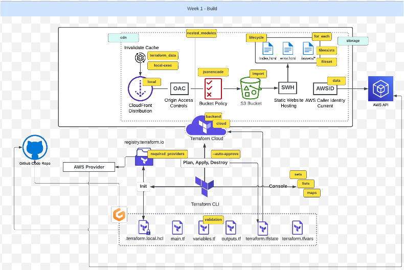

# Terraform Beginner Bootcamp 2023 - Week  1
[Week-1 Architecture](#week-1-architecture) 

[Notes for Quick Reference](#notes-for-quick-reference)
- [Fixing Tags](#fixing-tags)
- [Root Module Structure](#root-module-structure)
    * [Root module](#root-module)
- [Terraform and Input Variables](#terraform-and-input-variables)
    * [Terraform Cloud Variables](#terraform-cloud-variables)
    * [Terraform Variables](#terraform-variables)
    * [Declaring an Input Variable - example](#declaring-an-input-variable---example)
    * [Loading Terraform Input Variables](#loading-terraform-input-variables)
        + [var flag](#var-flag)
        + [terraform.tvfars](#terraformtvfars)
        + [var-file flag](#var-file-flag)
        + [auto.tfvars](#autotfvars)
    * [Order of terraform input variables](#order-of-terraform-input-variables)
        + [Regex with variable conditions](#regex-with-variable-conditions)
        + [Considerations for using variable with Terraform Cloud](#considerations-for-using-variable-with-terraform-cloud)
- [Dealing With Configuration Drift](#dealing-with-configuration-drift)
- [What is Configuration drift?](#what-is-configuration-drift-)
- [What happens if we lose our `terraform.tfstate` state file?](#what-happens-if-we-lose-our--terraformtfstate--state-file-)
  * [Fix Missing Resources with Terraform Import](#fix-missing-resources-with-terraform-import)
  * [Fix Manual Configuration](#fix-manual-configuration)
- [Terraform Modules](#terraform-modules)
  * [Terraform Module Structure](#terraform-module-structure)
  * [Passing Input Variables](#passing-input-variables)
  * [Modules Sources](#modules-sources)
  * [Module Outputs](#module-outputs)
- [Considerations when using ChatGPT to write Terraform](#considerations-when-using-chatgpt-to-write-terraform)
- [S3 Static website hosting using Terraform](#s3-static-website-hosting-using-terraform)
- [Working with Files in Terraform](#working-with-files-in-terraform)
  * [Fileexists function](#fileexists-function)
  * [Filemd5](#filemd5)
  * [Path Variable](#path-variable)
- [Terraform Console](#terraform-console)
- [Terraform Locals](#terraform-locals)
- [Terraform Data Sources](#terraform-data-sources)
- [Defining IAM Policies in TF code - Working with JSON](#defining-iam-policies-in-tf-code---working-with-json)
  * [Changing the Lifecycle of Resources](#changing-the-lifecycle-of-resources)
- [Terraform Data](#terraform-data)
- [Provisioners](#provisioners)
  * [Local-exec](#local-exec)
  * [Remote-exec](#remote-exec)
- [Heredoc String](#heredoc-string)
- [Fileset Function](#fileset-function)
- [For Each Expressions](#for-each-expressions)
- [Terraform Expressions](#terraform-expressions)
  * [Expression Types and Values](#expression-types-and-values)
  * [Collection Types](#collection-types)

# Week 1 Architecture


The complete end-to-end architecture of what we will achieve at the end of the bootcamp is available [here](https://lucid.app/lucidchart/e3f15b1a-2211-4ddb-8c95-f144c2504db4/edit?invitationId=inv_0873b3c6-c652-463f-9f2b-fa0f1b420823&page=0_0#) 

_Diagram copyrights: Andrew Brown from ExamPro.co_

-----------------------------------------------------------------------------------------------------
# Notes For Quick Reference
## Fixing Tags

[How to Delete Local and Remote Tags on Git](https://devconnected.com/how-to-delete-local-and-remote-tags-on-git/)

Locally delete a tag
```sh
git tag -d <tag_name>
```

Remotely delete tag
```sh
git push --delete origin tagname
```

Checkout the commit that you want to retag. Grab the SHA from your Github history.
```sh
git checkout <SHA>
git tag M.M.P
git push --tags
git checkout main
```

example:
```sh
git checkout 2813847
git tag 1.1.0
git push --tags
```
## Root Module Structure
Our root module structure is as follows:

```
PROJECT_ROOT
│
├── main.tf                 # everything else.
├── variables.tf            # stores the structure of input variables
├── terraform.tfvars        # the data of variables we want to load into our terraform project
├── providers.tf            # defined required providers and their configuration
├── outputs.tf              # stores our outputs
└── README.md               # required for root modules
```

[Standard Module Structure](https://developer.hashicorp.com/terraform/language/modules/develop/structure)

#### Root module
- mandatory element
- Terraform files must exist in the root directory of the repository
- primary entrypoint for the module 

**README**
- The root module and any nested modules should have README files
- This file should be named `README` or `README.md`. 
- should contain the description of the module and what it should be used for.
- **examples** can be included in a `examples` directory

**LICENSE**
-  The license under which this module is available

`main.tf`, `variables.tf`, `outputs.tf` : are the recommended filenames for a minimal module, even if they are empty.


Example of a minimal recommended module following the standard structure

```txt
$ tree minimal-module/
.
├── README.md
├── main.tf
├── variables.tf
├── outputs.tf
```

Complete structure example:

```txt
$ tree complete-module/
.
├── README.md
├── main.tf
├── variables.tf
├── outputs.tf
├── ...
├── modules/
│   ├── nestedA/
│   │   ├── README.md
│   │   ├── variables.tf
│   │   ├── main.tf
│   │   ├── outputs.tf
│   ├── nestedB/
│   ├── .../
├── examples/
│   ├── exampleA/
│   │   ├── main.tf
│   ├── exampleB/
│   ├── .../
```

## Terraform and Input Variables

## Terraform Cloud Variables

In terraform we can set two kind of variables:
- Enviroment Variables - those you would set in your bash terminal eg. AWS credentials
- Terraform Variables - those that you would normally set in your tfvars file

We can set Terraform Cloud variables to be sensitive so they are not shown visibliy in the UI.

## Terraform Variables
[Terraform Variables](https://developer.hashicorp.com/terraform/language/values/variables)
- similar to shell input variables/function arguments.
- are 
- let you customize aspects of Terraform modules without altering the module's own source code. 
- allows reusing modules across different Terraform configurations (example: same code used for different envs like dev, prod, qa etc.)
- good practice to briefly describe the purpose of each variable using the optional `description` argument:
> For brevity, input variables are often referred to as just "variables" or "Terraform variables"

### Declaring an Input Variable - example
```tf
variable "availability_zone_name" {
  type    = string
  default = "eu-central-1a"
  description = "The availablity zone in which our AWS resources will be created."
}
```

### Loading Terraform Input Variables

[Terraform Input Variables](https://developer.hashicorp.com/terraform/language/values/variables)

### var flag
We can use the `-var` flag to set an input variable or override a variable in the tfvars file eg. `terraform -var user_ud="my-user_id"`

### var-file flag

We can use the `-var-file` flag to specify a variable file when running `terraform apply` or `terraform plan`. 

This allows us to define variables in a separate file and then reference that file when we run Terraform commands. 

This can be useful for managing and sharing configuration options without modifying the main Terraform configuration file.
Example:
```sh
terraform apply -var-file=variables.tfvars
```

### terraform.tvfars

This is the default file to load in terraform variables in blunk.

### auto.tfvars

The `auto.tfvars` file is a special filename that Terraform automatically loads as a variable file without the need to specify it using the `-var-file` flag. 

When Terraform runs, it will automatically look for and load variable values from a file named auto.tfvars in the same directory as your Terraform configuration files.

We can use auto.tfvars to define default values for our variables, and these values will be applied unless overridden by values from other variable files or explicit command-line variable definitions.

### Order of Terraform Variables

Variables can be set and overridden in several ways, and they follow a specific order of precedence. Here's the order in which variables take precedence:

- **Environment Variables**: The highest precedence is given to variables set via environment variables. We can set variables by prefixing them with TF_VAR_ and then specifying the variable name in uppercase. For example,
```sh
TF_VAR_region=us-west-2
```
- **Command-Line Flags**: Variables specified directly on the command line take precedence over environment variables. We can use the -var flag to set a variable when running Terraform commands. For example,
```sh
terraform apply -var="region=us-west-1"
```
- **Variable Files**: Variable files specified with the -var-file flag. These files can define default values for variables. When used, these values will override any previous variable values. For example,
```sh
terraform apply -var-file=variables.tfvars
```
- **Default Values**: If no value is provided by any of the above methods, the default value specified in the variable definition within the Terraform configuration takes effect.
- **No Value**: If a variable is not set using any of the methods above and has no default value specified, Terraform will prompt the user for a value when running the apply or plan command. This is an interactive method, and it should be avoided in automated or non-interactive workflows.

#### Regex with variable conditions
`regex` applies a regular expression to a string and returns the matching substrings.

[Terraform Regex](https://developer.hashicorp.com/terraform/language/functions/regex)

```
variable "user_uuid" {
  description = "The UUID of the user"
  type        = string
  validation {
    condition        = can(regex("^[0-9a-fA-F]{8}-[0-9a-fA-F]{4}-[1-5][0-9a-fA-F]{3}-[89abAB][0-9a-fA-F]{3}-[0-9a-fA-F]{12}$", var.user_uuid))
    error_message    = "The user_uuid value is not a valid UUID."
  }
}
```

#### Considerations for using variable with Terraform Cloud

You can set two different types of variables in Terraform cloud
- Environment Variables - vars that are required for the functionality to work. (those you would normally set in $PATH of your bash terminal). Vars like AWS access key, secret access key and region would be a few examples.
- Terraform Variables - Those that you would normally set in the `terraform.tfvars` file

[Terraform Cloud Variables](https://developer.hashicorp.com/terraform/cloud-docs/workspaces/variables)


## Dealing With Configuration Drift

## What happens if we lose our state file?

If you lose your statefile, you most likley have to tear down all your cloud infrastructure manually.

You can use terraform port but it won't for all cloud resources. You need check the terraform providers documentation for which resources support import.

### Fix Missing Resources with Terraform Import

`terraform import aws_s3_bucket.bucket bucket-name`

[Terraform Import](https://developer.hashicorp.com/terraform/cli/import)
[AWS S3 Bucket Import](https://registry.terraform.io/providers/hashicorp/aws/latest/docs/resources/s3_bucket#import)

### Fix Manual Configuration

If someone goes and delete or modifies cloud resource manually through ClickOps. 

If we run Terraform plan is with attempt to put our infrstraucture back into the expected state fixing Configuration Drift

## Fix using Terraform Refresh

```sh
terraform apply -refresh-only -auto-approve
```

## Terraform Modules

### Terraform Module Structure

It is recommend to place modules in a `modules` directory when locally developing modules but you can name it whatever you like.

```txt
$ tree complete-module/
.
├── README.md
├── main.tf
├── variables.tf
├── outputs.tf
├── ...
├── modules/
│   ├── nestedA/
│   │   ├── README.md
│   │   ├── variables.tf
│   │   ├── main.tf
│   │   ├── outputs.tf
│   ├── nestedB/
│   ├── .../
├── examples/
│   ├── exampleA/
│   │   ├── main.tf
│   ├── exampleB/
│   ├── .../
```

### Passing Input Variables

We can pass input variables to our module.
The module has to declare the terraform variables in its own variables.tf

```tf
module "terrahouse_aws" {
  source = "./modules/terrahouse_aws"
  user_uuid = var.user_uuid
  bucket_name = var.bucket_name
}
```

### Modules Sources

Using the source we can import the module from various places eg:
- locally
- Github
- Terraform Registry

```tf
module "terrahouse_aws" {
  source = "./modules/terrahouse_aws"
}
```

[Modules Sources](https://developer.hashicorp.com/terraform/language/modules/sources)

### Module Outputs
- modules can define their own o/ps
`modules/terrahome_aws/outputs.tf`
```tf
output "bucket_name" {
  value = aws_s3_bucket.website_bucket.bucket
}
```

The outputs are only **visible within the module itself**. If we want to have the outputs available at the root level, we need to make reference in the root `outputs.tf` to the output of the module.
eg:
```tf
output "bucket_name" {
    description = "Bucket name for our static website"
    value = module.terrahouse_aws.bucket_name               
}
```

- similar to _module input vars_ , the module o/ps need to be referenced in the root level `outputs.tf`
```tf
output "bucket_name" {
  description = "Bucket name for our static website hosting"
  value = module.terrahouse_aws.bucket_name
}
```

## Considerations when using ChatGPT to write Terraform

LLMs such as ChatGPT may not be trained on the latest documentation or information about Terraform.

It may likely produce older examples that could be deprecated. Often affecting providers.

## Working with Files in Terraform
Uploading files using TF (eg: upload obj in a S3 bucket) is not a necessarily a valid use case, since TF is all about managing state of resources. An object(index.html file) in our case is data.
TF supports `provisioners` which have the capability to remotely or locally execute commands, but it is not advisable to use these to upload data; we are still doing this in our project just to learn the capability. In a real production env, we won't use TF for data management.

[AWS S3 Object](https://registry.terraform.io/providers/hashicorp/aws/latest/docs/data-sources/s3_object)


### Fileexists function

This is a built in terraform function to check the existance of a file.

```tf
condition = fileexists(var.error_html_filepath)
```

https://developer.hashicorp.com/terraform/language/functions/fileexists

### Filemd5

https://developer.hashicorp.com/terraform/language/functions/filemd5

### Path Variable

In terraform there is a special variable called `path` that allows us to reference local paths:
- path.module = get the path for the current module
- path.root = get the path for the root module

[Special Path Variable](https://developer.hashicorp.com/terraform/language/expressions/references#filesystem-and-workspace-info)

```tf
resource "aws_s3_object" "index_html" {
  bucket = aws_s3_bucket.website_bucket.bucket
  key    = "index.html"
  source = "${path.root}/public/index.html"
```

## Terraform Locals

Locals allows us to define local variables.
It can be very useful when we need transform data into another format and have referenced a varaible.

```tf
locals {
  s3_origin_id = "MyS3Origin"
}
```
[Local Values](https://developer.hashicorp.com/terraform/language/values/locals)

## Terraform Data Sources

This allows use to source data from cloud resources.

This is useful when we want to reference cloud resources without importing them.

```tf
data "aws_caller_identity" "current" {}

output "account_id" {
  value = data.aws_caller_identity.current.account_id
}
```
[Data Sources](https://developer.hashicorp.com/terraform/language/data-sources)

## Defining IAM Policies in TF code - Working with JSON

We use the jsonencode to create the json policy inline in the hcl.

```tf
> jsonencode({"hello"="world"})
{"hello":"world"}
```

[jsonencode](https://developer.hashicorp.com/terraform/language/functions/jsonencode)

### Changing the Lifecycle of Resources

[Meta Arguments Lifcycle](https://developer.hashicorp.com/terraform/language/meta-arguments/lifecycle)


## Terraform Data

Plain data values such as Local Values and Input Variables don't have any side-effects to plan against and so they aren't valid in replace_triggered_by. You can use terraform_data's behavior of planning an action each time input changes to indirectly use a plain value to trigger replacement.

https://developer.hashicorp.com/terraform/language/resources/terraform-data

## Provisioners

Provisioners allow you to execute commands on compute instances eg. a AWS CLI command.

They are not recommended for use by Hashicorp because Configuration Management tools such as Ansible are a better fit, but the functionality exists.

[Provisioners](https://developer.hashicorp.com/terraform/language/resources/provisioners/syntax)

### Local-exec

This will execute command on the machine running the terraform commands eg. plan apply

```tf
resource "aws_instance" "web" {
  # ...

  provisioner "local-exec" {
    command = "echo The server's IP address is ${self.private_ip}"
  }
}
```

https://developer.hashicorp.com/terraform/language/resources/provisioners/local-exec

### Remote-exec

This will execute commands on a machine which you target. You will need to provide credentials such as ssh to get into the machine.

```tf
resource "aws_instance" "web" {
  # ...

  # Establishes connection to be used by all
  # generic remote provisioners (i.e. file/remote-exec)
  connection {
    type     = "ssh"
    user     = "root"
    password = var.root_password
    host     = self.public_ip
  }

  provisioner "remote-exec" {
    inline = [
      "puppet apply",
      "consul join ${aws_instance.web.private_ip}",
    ]
  }
}
```
https://developer.hashicorp.com/terraform/language/resources/provisioners/remote-exec

## Heredoc String

A HereDoc is a multiline string or a file literal that is treated as a special block, for sending input streams to other commands and programs. HereDocs are especially useful when redirecting multiple commands at once, which helps make Bash scripts neater and easier to understand.
The most common syntax for here documents, originating in Unix shells, is `<<` followed by a delimiting identifier (often the word EOF or END), followed, starting on the next line, by the text to be quoted, and then closed by the same delimiting identifier on its own line.

```sh
<<EOT
hello
world
EOT
```
It permits the use of backslash`\` to divide string into seperate lines and make it more readable.

```tf
<<COMMAND
aws cloudfront create-invalidation \
--distribution-id ${aws_cloudfront_distribution.s3_distribution.id} \
--paths '/*'
    COMMAND
```

https://developer.hashicorp.com/terraform/language/expressions/strings#heredoc-strings


## Fileset Function
Fileset enumerates a set of regular file names given a path and pattern.

```tf
fileset(path, pattern)
```

[Fileset ](https://developer.hashicorp.com/terraform/language/functions/fileset)

A common use of `fileset` is to create one resource instance per matched file, using the for_each meta-argument

```tf
resource "example_thing" "example" {
  for_each = fileset(path.module, "files/*")

  # other configuration using each.value
}

```

## For Each Expressions

For each allows us to enumerate over complex data types

```sh
[for s in var.list : upper(s)]
```

This is mostly useful when you are creating multiples of a cloud resource and you want to reduce the amount of repetitive terraform code.

[For Each Expressions](https://developer.hashicorp.com/terraform/language/expressions/for)

## Terraform Expressions
Expressions are used to refer to or compute values within a configuration.
[Terraform expressions](https://developer.hashicorp.com/terraform/language/expressions/types)

### Expression Types and Values


### Collection Types


[Complex Types](https://developer.hashicorp.com/terraform/language/expressions/type-constraints#complex-types)


