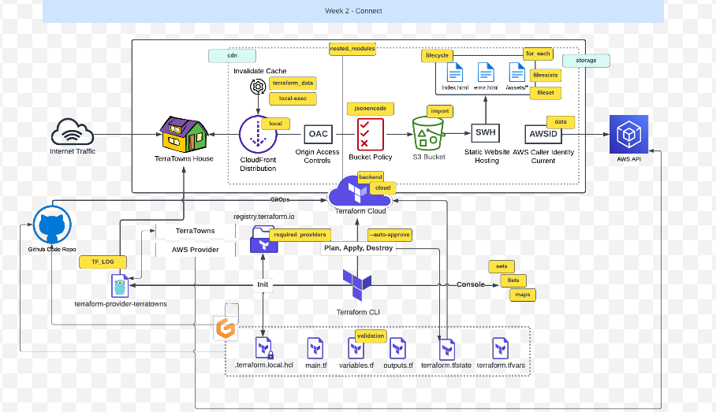

# Terraform Beginner Bootcamp 2023 - Week  2
[Week-2 Architecture](#week-2-architecture) 

[Notes for Quick Reference](#notes-for-quick-reference)
* [Our Custom Provider - explained](#our-custom-provider---explained)
  * [Working with Ruby](#working-with-ruby)
    + [Bundler](#bundler)
      - [Install Gems](#install-gems)
      - [Executing ruby scripts in the context of bundler](#executing-ruby-scripts-in-the-context-of-bundler)
    + [Sinatra](#sinatra)
  * [Terratowns Mock Server](#terratowns-mock-server)
    + [Running the web server](#running-the-web-server)
    + [HTTP Requests](#http-requests)
      - [Anatomy of a HTTP request](#anatomy-of-a-http-request)
      - [Bearer Authentication](#bearer-authentication)
      - [HTTP error codes](#http-error-codes)
  * [CRUD](#crud)
  * [More Terraform](#more-terraform)
    + [Terraform CLI Config File](#terraform-cli-config-file)
    + [Debugging Terraform](#debugging-terraform)
- [Configuring Terraform Cloud for Local Execution but Cloud backup of State File](#configuring-terraform-cloud-for-local-execution-but-cloud-backup-of-state-file)
- [Terrahome AWS Multi Home Refactor](#terrahome-aws-multi-home-refactor)
  * [Steps to add a new home](#steps-to-add-a-new-home)
- [Terraform State command](#terraform-state-command)
  * [terraform state list](#terraform-state-list)
  * [terraform state show](#terraform-state-show)
- [Terraform Object variable](#terraform-object-variable)

# Week 2 Architecture


The complete end-to-end architecture of what we will achieve at the end of the bootcamp is available [here](https://lucid.app/lucidchart/e3f15b1a-2211-4ddb-8c95-f144c2504db4/edit?invitationId=inv_0873b3c6-c652-463f-9f2b-fa0f1b420823&page=0_0#) 

_Diagram copyrights: Andrew Brown from ExamPro.co_

-----------------------------------------------------------------------------------------------------
# Notes For Quick Reference

## Our Custom Provider - explained
**Custom provider** named `terraform-provider-terratowns` (written in **golang**). 


The custom provider has a **resource** called `Home` which has four actions associated with it, namely:
- Read
- Update
- Create
- Delete

We have two servers:
i)  `TerraTowns` : `Development (Mock) Server` : `sinatra` server :  `localhost:4567`

ii) `TerraTowns.cloud` : `Production Server` : `rails`

> Sinatra : light-weight web server

> Rails : heavy-duty production server

We will use `bash scripts` under the path `/bin/terratowns/` to mock each of the four HTTP requests : 

i)   `create` 

ii)  `read`

iii) `update`

iv)  `delete`

|   	| TF Resource Action 	| HTTP Request Type 	|          API endpoint         	|
|---	|:------------------:	|:-----------------:	|:-----------------------------:	|
| 1 	| Create             	| POST              	| /api/u/:user_uuid/homes       	|
| 2 	| Read               	| GET               	| /api/u/:user_uuid/:uuid       	|
| 3 	| Update             	| PUT               	| /api/u/:user_uuid/homes/:uuid 	|
| 4 	| Delete             	| DELETE            	| /api/u/:user_uuid/homes/:uuid 	|


## Working with Ruby

### Bundler

Bundler is a package manager for runy.
It is the primary way to install ruby packages (known as gems) for ruby.

#### Install Gems

You need to create a Gemfile and define your gems in that file.

```rb
source "https://rubygems.org"

gem 'sinatra'
gem 'rake'
gem 'pry'
gem 'puma'
gem 'activerecord'
```

Then you need to run the `bundle install` command

This will install the gems on the system globally (unlike nodejs which install packages in place in a folder called node_modules)

A Gemfile.lock will be created to lock down the gem versions used in this project.

#### Executing ruby scripts in the context of bundler

We have to use `bundle exec` to tell future ruby scripts to use the gems we installed. This is the way we set context.

### Sinatra

- Sinatra is a DSL (Domain-Specific Language) for rapidly creating web applications in the Ruby programming language. 

- Sinatra is a micro web-framework for ruby to build web-apps.

- It is designed to be lightweight and easy to use, making it an ideal choice for small to medium-sized projects.

- It is great for mock or development servers or for very simple projects.

- You can create a web-server in a single file. 

https://sinatrarb.com/

## Terratowns Mock Server

### Running the web server

We can run the web server by executing the following commands:

```rb
bundle install
bundle exec ruby server.rb
```

All of the code for our server is stored in the `server.rb` file.

### HTTP Requests
#### Anatomy of a HTTP request


#### Bearer Authentication
Bearer authentication (also called token authentication) is an HTTP authentication scheme that involves security tokens called bearer tokens. 
The name “Bearer authentication” can be understood as "give access to the bearer of this token."
The bearer token is a cryptic string, usually generated by the server in response to a login request. 
The client must send this token in the Authorization header when making requests to protected resources: `Authorization: Bearer <token>`

[Bearer Authentication](https://swagger.io/docs/specification/authentication/bearer-authentication/)


#### HTTP error codes
[HTTP Error Codes](https://developer.mozilla.org/en-US/docs/Web/HTTP/Status#client_error_responses)

Our error codes:
custom aXXXX codes will help us isolate in our troubleshooting where an error may have occured. These are unique to this project and not something normally included. You want error codes to be kind of obfuscated in production environments to not give away to much information about what was wrong. Because we are learning here, these codes were implemented.

a1001 - token/code/access-code does not match

a1002 - user_uuid not passed in HTTP header

a1003 - token/code/acess-code and user_uuid

## CRUD

Terraform Provider resources utilize CRUD.

CRUD stands for Create, Read Update, and Delete

[What is CRUD?](https://en.wikipedia.org/wiki/Create,_read,_update_and_delete)

## More Terraform

### Terraform CLI Config File
`.terraformrc` or `terraform.rc` file

[Terraform Config-file](https://developer.hashicorp.com/terraform/cli/config/config-file)
- configures per-user settings for CLI behaviors, which apply across all Terraform working directories.

- In our project, this file tells TF the location of the code of our custom TF provider. 

### Debugging Terraform
Terraform has detailed logs that you can enable by setting the `TF_LOG` environment variable to any value. Enabling this setting causes detailed logs to appear on `stderr`.

`TF_LOG=DEBUG tf init`

[Terraform Debug](https://developer.hashicorp.com/terraform/internals/debugging)


## Configuring Terraform Cloud for Local Execution but Cloud backup of State File

[Terraform Remote Operation](https://developer.hashicorp.com/terraform/cloud-docs/run/remote-operations)


## Terrahome AWS Multi Home Refactor

We altered the paths and variables associated to the content to our static Websites, in order to accomodate the creation of more than one home.

### Steps to add a new home

- Add your home to the `terraform.tfvars.example` and the `terraform.tfvars` making sure to change the block for your new content
    ```tf
    YOURHOME = {
      public_path = "/workspace/terraform-beginner-bootcamp-2023/public/YOURHOMEDIRECTORY"
      content_version = 1 
    }
    ```
- Add you new module to `main.tf` making sure to change the block for your new content
    ```
    module "home_YOURHOME" {
      source = "./modules/terrahome_aws"
      user_uuid = var.teacherseat_user_uuid
      public_path = var.YOURHOME.public_path
      content_version = var.YOURHOME.content_version
    }
    ```
- Add your new resource to `main.tf` making sure to change the block for your new content
    ```
    resource "terratowns_home" "YOURHOME" {
      name = "Travle Blog"
      description = <<DESCRIPTION
    add description here
    DESCRIPTION
      town = "TOWN"
      content_version = var.YOURHOME.content_version
      domain_name = module.YOURNEWMODULE.domain_name
    }
    ```
	
	Example:
	```tf
		module "home_/krakow" {
		source = "./modules/terrahome_aws"
		user_uuid = var.teacherseat_user_uuid
		public_path = var.krakow_public_path
		content_version = var.content_version
		}
    ```

- Create a new directory under `./public` with your home name. This directory expects the following:
    - `index.html`
    - `error.html`
    - `/assets/`
        - **All top level files in assets will be copied, but not any subdirectories.**

- `terraform init`
- `terraform plan`
- `terraform apply --auto-approve`


## Terraform State Command
The terraform state command is used for advanced state management. As your Terraform usage becomes more advanced, there are some cases where you may need to modify the Terraform state. Rather than modify the state directly, the terraform state commands can be used in many cases instead.

[Terraform State Command](https://developer.hashicorp.com/terraform/cli/commands/state)

### terraform state show
`terraform state show` command is used to show the attributes of a single resource in the TF state.

[Article on Terraform State Show Command](https://developer.hashicorp.com/terraform/cli/commands/state/show)

Example:
```tf
$ terraform state show 'packet_device.worker'
# packet_device.worker:
resource "packet_device" "worker" {
    billing_cycle = "hourly"
    created       = "2015-12-17T00:06:56Z"
    facility      = "ewr1"
    hostname      = "prod-xyz01"
    id            = "6015bg2b-b8c4-4925-aad2-f0671d5d3b13"
    locked        = false
}
```

### Terraform State List
The `terraform state list` command is used to list resources within a Terraform state. 
By deafult it will read the `terraform.tfstate` file if it exists (or read from the state maintained in TF cloud)

[Article on Terraform State List Command](https://developer.hashicorp.com/terraform/cli/commands/state/list)

Example:
```tf
$ terraform state list
aws_instance.foo
aws_instance.bar[0]
aws_instance.bar[1]
module.elb.aws_elb.main
```


## Terraform Object variable
In Terraform, object variables allow you to define complex data structures by grouping multiple simple data types into a single variable. These variables are used to represent structured data and are especially useful when dealing with more complex configurations. Here's an explanation of object variables in Terraform:

**Definition**: Object variables are defined within your Terraform configuration to hold structured data, similar to objects or dictionaries in other programming languages.

**Usage**: You can use object variables to pass structured data, such as configuration settings or parameters, into your Terraform modules or resources.

**Syntax**: To define an object variable, use the `variable` block in your Terraform code, specifying the variable name and its type. The type should be set to `map` with attribute types to define the structure.

Example:
```tf
variable "recipe" {
  type = object({
    public_path = string
    content_version = number
  })
}
```

**Accessing Attributes**: You can access the attributes of an object variable using the variable name and dot notation.

Example:
```tf
public_path = var.recipe.public_path
content_version = var.recipe.content_version
```

-----------------------------------------------------------------------------------------------------